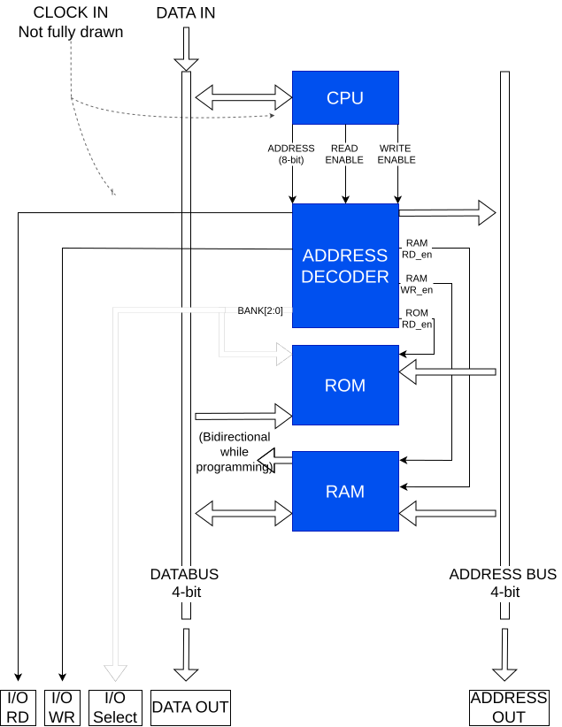
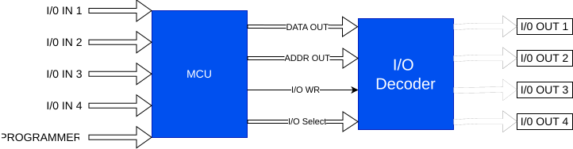
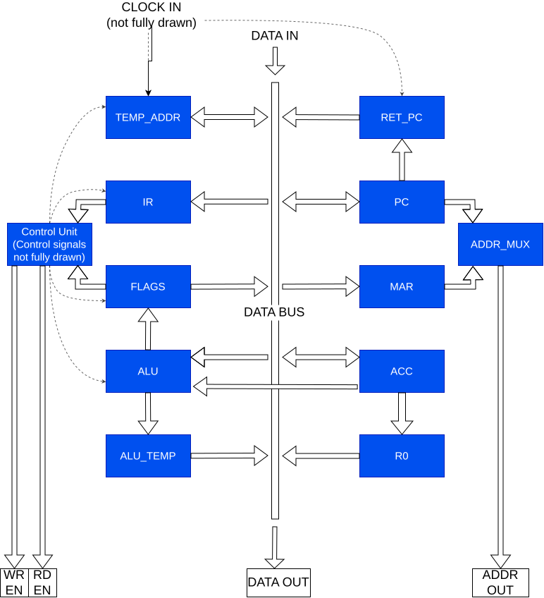
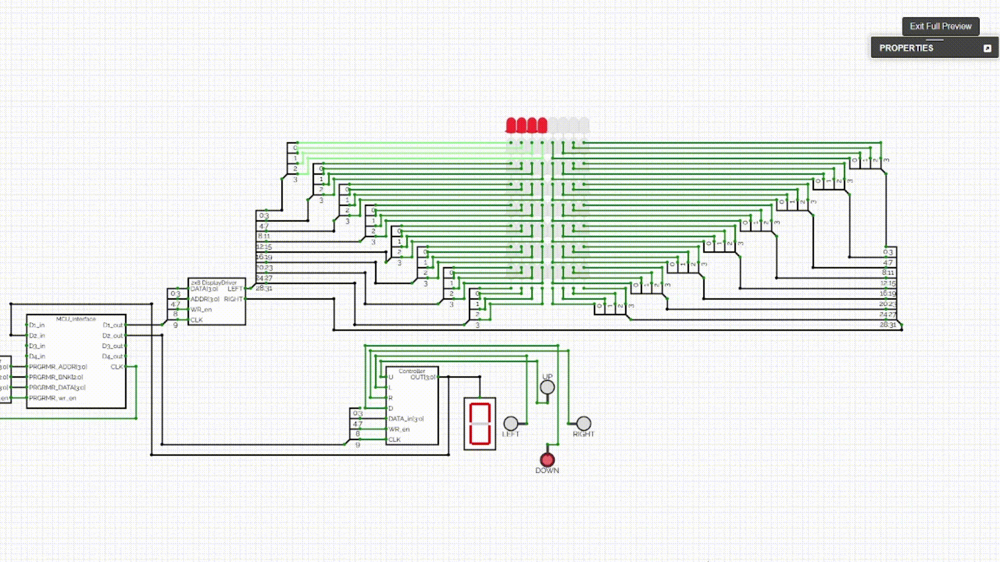

# CircuitVerse 4-Bit Microcontroller Project

A fully simulated 4-bit microcontroller built in CircuitVerse.
Includes a CPU, ROM, RAM and MMIO, plus a custom assembler for my own instruction set architecture (ISA).

## Table of Contents
* [Overview](#overview)
* [Running The Simulation](#running-the-simulation)
* [Key Features](#key-features)
* [System Architecture](#system-architecture)
    * [MCU Core](#mcu-core)
    * [I/O Interface Layer](#mcu-io-interface-layer)
    * [CPU Datapath & Control](#cpu-datapath--control)
* [Toolchain](#toolchain)
* [Example Program](#example-program)
* [Documentation](#documentation)

## Overview
This project demonstrates low-level microcontroller design principles using CircuitVerse, from gates to a complete CPU architecture. 

It showcases digital logic design, CPU architecture, memory management, memory-mapped I/O, and assembly-level programming.

This was a great project to learn about embedded systems, ISA design, and low-level hardware-software interaction.

> **Design note:**  
> This project intentionally uses simplified, high-level diagrams.  
> Internal control signals, mux select lines, and microcode sequencing are abstracted to emphasize architectural structure and programmer-visible behavior rather than gate-level completeness. Those details can be explored in the CircuitVerse simulation itself.

## Running the simulation
You can run the simulation directly in CircuitVerse web-based simulator. You can find the project [here](https://circuitverse.org/users/368690/projects/cpu-3-0). This requires a CircuitVerse account which is free and fast to create. You can also fork the project to your own account to make modifications. 

> **Note:**The simulation engine itself is not very performant, and the project is fairly complex, so be patient while it loads and simulates. The simulations clock signal caps at 20 Hz, so complex programs are rather slow to execute.  

## Key Features
- 4-bit CPU with microcode-based control unit
- 128-word ROM, 16-word RAM (expandable)
- Memory-mapped I/O architecture with 4 x general purpose 16-address MMIO channels
- Custom 16 instructions ISA including acc operations, conditional jumps, memory access and indirect addressing.
- External “programmer” interface for loading programs into ROM
- Custom assembler written in C to generate executable machine code
- HTML-based microcode editor for configuring control signals per microstep
- Example programs demonstrating MMIO and control flow

## System Architecture
The microcontroller architecture consists of three main layers:
### MCU Core
High-level view of the microcontroller, showing the CPU, ROM, RAM, address decoder, and memory-mapped I/O.
This level represents the complete MCU core and its internal components.

### MCU I/O Interface Layer
A clean wrapper around the MCU core that exposes standardized MMIO interfaces for external devices.  
This layer abstracts internal bus and decoding logic into a reusable, device-friendly interface.

    
### CPU Datapath & Control
Internal structure of the 4-bit CPU, including registers, ALU, control unit, and microcode sequencing.

## Toolchain
To support development and execution of programs on the MCU, the project includes a small custom toolchain:

- A custom [assembler](assembler/main.c) written in C that converts assembly source code into machine code compatible with the MCU ISA.
- In simulation programmer module that loads compiled programs into ROM at startup.
- An HTML-based [microcode editor](microcode/control_signal_finder.html) used to configure control signals per micro-instruction and generate microcode ROM contents.

## Example Program

The project includes example programs demonstrating control flow, memory access, and memory-mapped I/O.
The video below shows a [program](examples/control_leds.md) running on the MCU that reads input from a controller device and updates LED outputs via MMIO.

## Documentation

- **Instruction Set Architecture:** [`docs/ISA.md`](docs/ISA.md)
- **Assembly Programming Guide:** [`docs/assembly_guide.md`](docs/assembly_guide.md)
- **Example Programs:** [`examples/`](examples/)
- **Microarchitecture & Control Signals:** [`docs/microarchitecture.md`](docs/microarchitecture.md)
- **Microcode Tools:** [`microcode/control_signal_finder.html`](microcode/control_signal_finder.html)
