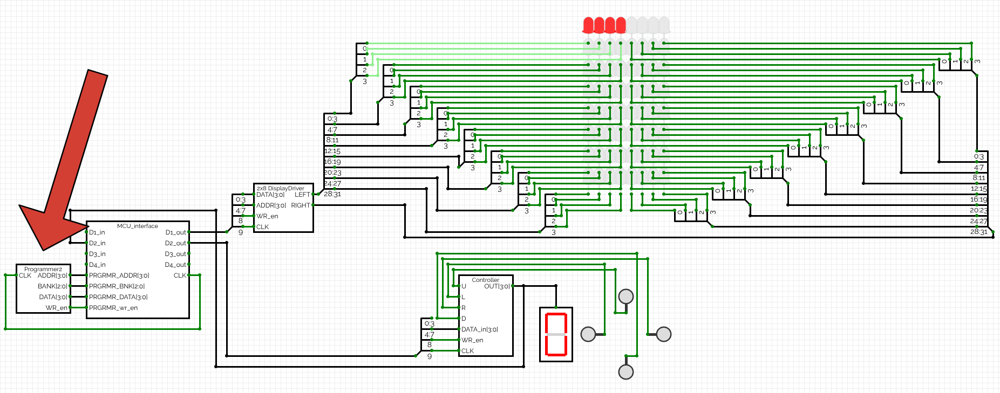
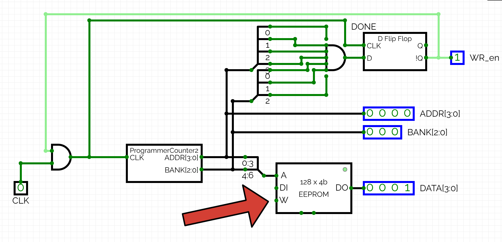

# Writing and Assembling Programs using the custom ISA

This guide provides an overview of writing assembly programs for the custom 4-bit CPU architecture described in the ISA documentation. It also covers how to use the assembler to convert assembly code into machine code, and run it on the CPU simulator.

## Writing Assembly Programs

### Instructions
The assembly language consists of mnemonics that correspond to the CPU instructions. Full set of instructions can be found in the [ISA documentation](ISA.md#instruction-set). Instructions may take zero or more operands. Instructions and operands are separated by spaces, but might be surrounded by tabs.

### Labels
Labels define symbolic addresses and can be used as jump targets. Labels are defined by writing the label name followed by a colon (`:`) at the start of a line. They can then be referenced in instructions like JMP or CALL.

Example of an infinite loop using a label:
```
START:          ; Define label START
    ADDI 1      ; Add immediate value 1 to ACC
    JMP START   ; Jump back to START after each addition
```

### Constants
The assembler supports symbolic constants using EQU syntax. Constants are defined by writing the constant name followed by `EQU` and the value.
```
Example:
ADDRESS EQU 0xC0
VALUE EQU 5

    LDI VALUE
    STA ADDRESS
```

### Comments
Comments start with a semicolon (`;`) and continue to the end of the line. Comments can be placed after an instruction.

Example of valid comments:
```
    LDI 0x3   ; Load immediate value 3 into ACC
    ADDI 2    ; Add immediate value 2 to ACC
```

### Example
A simple example program that increments ACC until it reaches 10:
```
START_VALUE EQU 0x00    ; Constant for starting value
MAX_VALUE EQU 0x0A      ; Constant for maximum value

START:                  ; Just for improved clarity, at no cost
    LDI START_VALUE     ; Load starting value into ACC
LOOP:
    ADDI 1              ; Increment ACC by 1
    CMPI MAX_VALUE      ; Compare ACC with MAX_VALUE
    JZ END              ; If ACC == MAX_VALUE, jump to END
    JMP LOOP            ; Otherwise, repeat the loop
END:
    NOP                 ; End of program
```

## Assembling the Program
To assemble the assembly code into machine code, use the provided [assembler tool](../assembler/main.c).
1. Save your assembly code in a file named `input.ass` in the same directory as the assembler .
2. Compile the assembler code using a C compiler (e.g., `gcc main.c -o assembler`).
3. Run the assembler: `./assembler`. This will generate a file named `output.txt`.
4. The `output.txt` file contains the machine code in hexadecimal format, ready to be loaded into the CPU simulator.

## Running the Program on the CPU Simulator
1. Open the CPU simulator.
2. Open the `I/O world` tab in the simulator.
3. Double click on the `Programmer` component to open its interface.



4. Double click on the `EEPROM` component to open its interface.



5. Paste the contents of `output.txt` into the EEPROM's input prompt. You can find example programs in the [examples](../examples/) directory.

 

6. Go back to the `I/O world` tab and test the program by running the CPU simulator. 
> **Note:** Everytime you open `I/O world` tab, the programmer will run, and rewrite the ROM of the MCU. This takes roughly 15 seconds, so be patient!